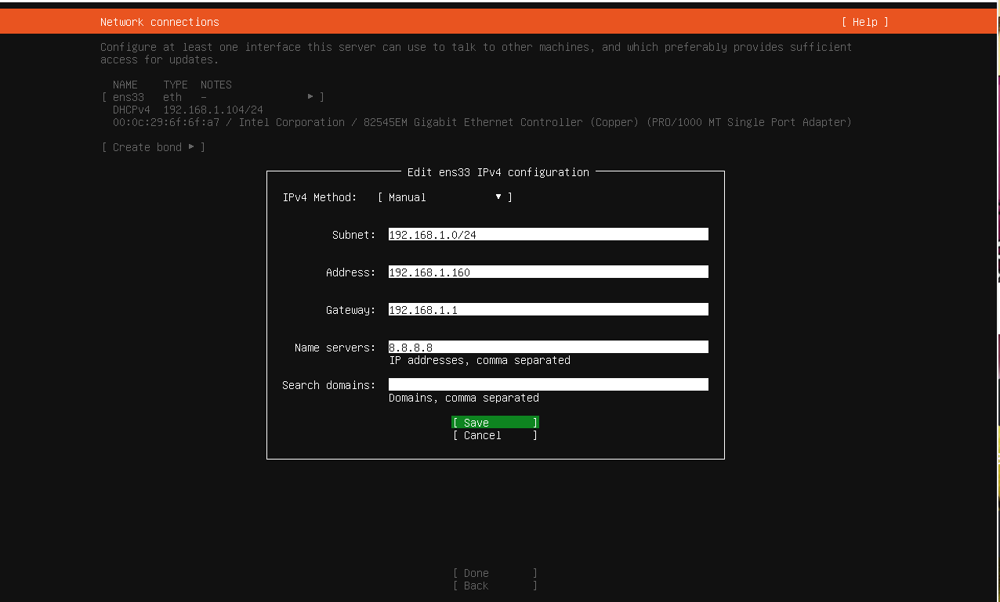
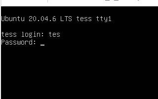
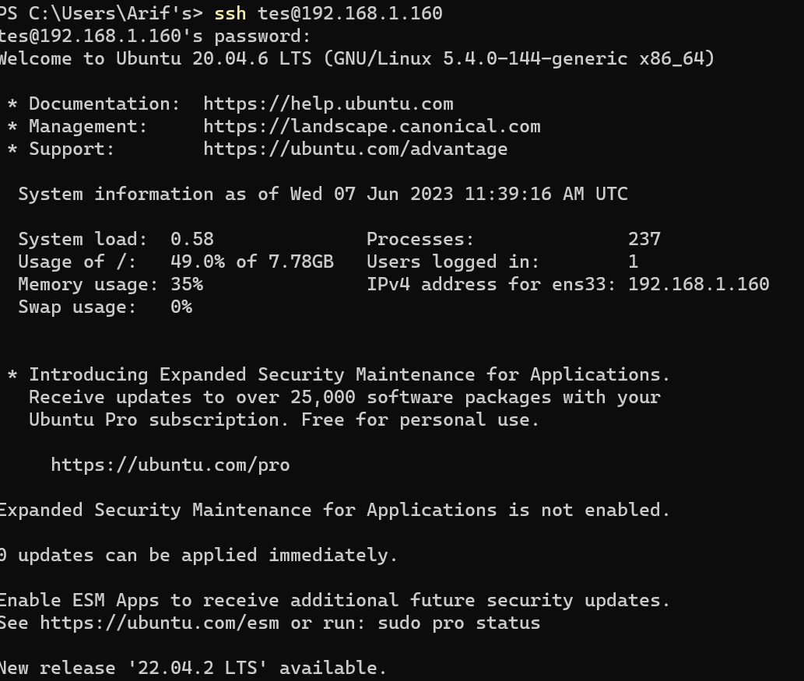
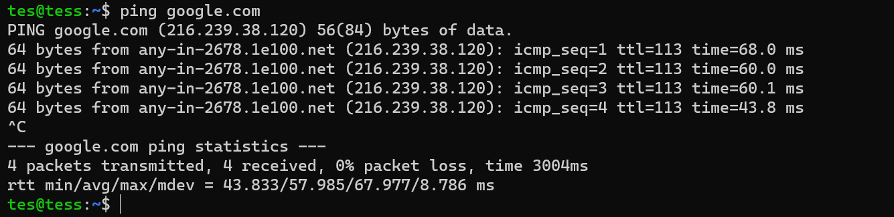

# 1. Definisi Devops

DevOps adalah gabungan dari dua suku kata, yaitu Development (Dev) dan Operations (Ops) yang memiliki makna penggabungan antara dua proses dari tim pengembang aplikasi dan juga tim operasional.Salah satu alasan adanya proses DevOps adalah untuk mempercepat proses building hingga rilisnya sebuah aplikasi.

---
# 2. Lifecycle Dalam DevOps

Ada beberapa lifecycle dalam DevOps sebagai berikut :
1. Continuous Integration
Dalam tahap ini, peran DevOps adalah untuk melakukan build dan automation testing. DevOps akan mencari tahu apakah ada error yang ada dan akan segera langsung diperbaiki. Saat berada di fase ini, seorang DevOps akan menggunakan tools berupa Source Code Repository (SCR) untuk menemukan error code dan fixed code.
2. Continuous Delivery
Memasuki tahap selanjutnya, tim akan melakukan analisa dan juga pengujian secara manual untuk memperbaiki error yang ada. Lalu, setelah proses pengujian selesai, tim akan langsung memberikan pembaharuan pada aplikasi.
3. Continuous Deployment
Setelah lolos dari tahap sebelumnya, maka tim development bisa melakukan environment test yang disebut dengan UAT stage (fase user acceptance testing), adalah pengujian yang menitikberatkan pada aspek fungsional dari suatu sistem.
4. Configuration Management
Tahap selanjutnya yang dilakukan oleh DevOps adalah berkaitan dengan pemeliharaan konfigurasi pada aplikasi. Proses ini memungkinkan untuk otomatisasi dan standardisasi konfigurasi produk, tim juga harus memastikan semua proses otomatisasi pada aplikasi berjalan baik.
5. Infrastructure as a Code (IAC)
IAC adalah pengelolaan infrastruktur (jaringan, mesin virtual, penyeimbang beban, dan topologi koneksi) dalam model deskriptif, menggunakan versi yang sama seperti yang digunakan tim DevOps untuk kode sumber. Tanpa IAC, tim harus memelihara pengaturan lingkungan penyebaran individu. 
6. Logging & Monitoring
Logging berfungsi untuk mendapatkan data Log untuk membantu tim DevOps dalam mengidentifikasi error yang ditemui. Sementara Monitoring berfungsi untuk mendeteksi semua hal yang terjadi pada sistem.

---
# Langkah-langkah instal ubuntu server 20.04.xx di vmware

1.	Pastikan sudah mendwonload vmware dan ubuntu server 20.04.xx
2.	Setelah dinstal vmwarenya sekarang jalankan vmwarenya
3.	Pilih create new virtual machine klik enter

4.	Pilih installer disc image file, pilih cari file ubuntu server 20.04.xx yang kita download tadi, klik next.

5.	Masukan nama, user name dan password yang kita inginkan (jangan sampe lupa password dan usernamenya), klik next.

6.	Ganti nama virtual mechine sesuai username kita, klik next.

7.	Masukan ruang yang kita inginkan, misal saya ambil 10 GB, dan pilih split virtual disk into multiple file, klik next.

8.	Disini kita pilih customize Hardwere untuk seting memory, prosesor dan network adapternya, disini saya kasih memory (1Gb), Prosesornya (1) jangan lupa centang bagian virtualize intel VT-x/EPT or AMD-v/RV1, dan adaptornya saya pilih adaptor LAN. Setelah itu pilih close dan finish agar dijalankan vmwarenya ubuntu server 20.04.xx.ISO

    

 - Dibagian Memory 
 
    

- Dibagian Prosesor
    

- Dibagian Network Adapter Pilih Bridged selanjutnya pilih Configure Adapters, seting adapter yang kalian pakai. Disini saya pakai jaringan LAN.

    

    

9.	Setelah seting dibagian hardware sudah selesaih pilih Ok>>Close>>Finish. Selanjutnya mesin akan menjalankan prosess selanjutnya. Step selanjutnya kita akan memilih bahasa saya memilih bahasa english klik enter.

    

10.	Pilih continues without updating klik enter.

    

11.	Keyboard configuration dibiarkan saja default lalu klik Done.

    

12.	Di Network Connections pilih ens33 eth klik enter untuk mengganti subnet, 

    

- Pilih edit Ipv4

    

-	Pilih manual klik enter.

    

- Disini sesuaikan subnet dengan jaringan kita, Adrress sesuaikan ip yang belum digunakan oleh perangkat dijaringan kita,gateway sesuaikan dengan jaringan kita, dan Name Servers isi dengan domain google. Lalu pilih save.

    

- Setelah selesai pilih Done

    

13.	Dikonfigurasi proxy kita skip saja, langsung pilih done.

    

14.	Dikonfigurasi ubuntu archive mirror juga dibiarkan default saja dan pilih done.

    

15.	Dibagian guieded storage konfigurasi pilih Custom storage layout pilih Done.

    

16.	Dibagian storage configuration pilih free space tekan enter.

    

- Isi kapasitas penyimpananya jangan lebih dari 10GB, karena kita seting hardwarenya 10 GB. Pertama pilih format  ext4 dan mount dibiarkan default setelah selesai tekan create.

    

- Yang kedua seting sizenya, formatnya dibikin Swap dan mountnya dibiarkan, tekan create setelah selesai.

    

- Setelah di setting semua kapasitas penyimpananya maka muncul seperti dibawah ini. Lalu klik done.

    

- Setelah dirasa sudah benar semua pilih tombol continue 

    

17.	Setelah konfigurasi storage maka akan di arahkan di profil setup seperti dibawah ini. Disini isi dengan profile dan password yang kita sudah seting di awal tadi. Lalu pilih done.

    

18.	Stelah seting profile akan diarahkan seting ssh centang install OpenSSH server. Lalu pilih Done.

    

19.	Difeatured server snaps kita kosongkan saja lalu pilih done.

    

20.	Lalu tunggu penginstallan server ubuntu sampe selesai dan di reboot terlebih dahulu.

    

21.	Setelah berhasil reboot masukan username dan password untuk login  ubuntu server

    

22. Buka windows terminal masukan perintah 'ssh tes@192.168.1.160' klik enter. ini untuk mengakses server ubuntu kita lewat ssh.

    

23. Setelah masuk ke server ketik 'ping google' jika berhasil maka server kita sudah dapat digunakan.

    

