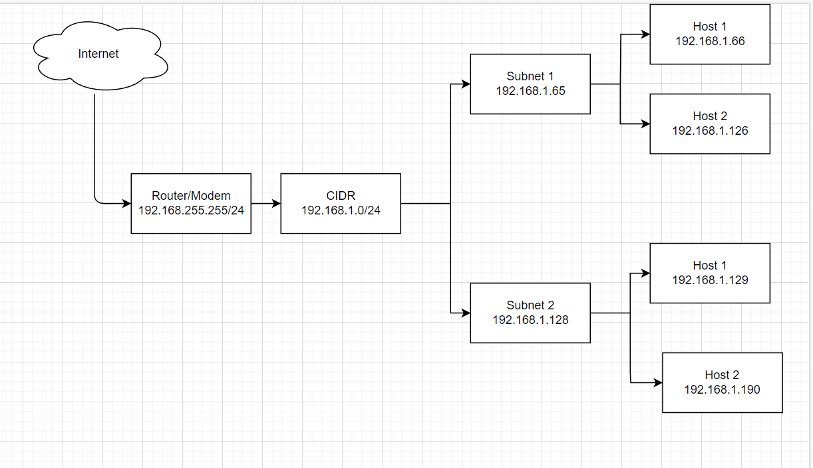

# 1.	Perbedaan antara IP Private & Public, serta IP Dynamic & Static!
Jawaban : 

1. IP Private adalah alamat IP yang digunakan oleh jaringan local dan tidak bisa diakses dari jaringan internet atau diluar jaringan yang ada di Gedung tersebut, contoh sharing printer dll.
2. IP Public adalah alamat yang digunakan untuk global yang dapat diakses dari jaringan internet, atau dapat diakses dari Gedung satu ke Gedung lainya maupun antar negara contoh seseorang yang berada di Indonesia mengakses alamat ip yang berada di Singapura.
3. IP Dynamic adalah alamat ip yg berubah-ubah diberikan oleh router karena penggunaannya yang bergantian.
4. IP Static adalah alamat Ip yang tidak berubah-ubah, alamat IP ini biasanya digunakan untuk server, atau perangkat yang penting. 

---

# 2. Buat rancangan sebuah jaringan dengan spesifikasi sebagai berikut!
- CIDR Block : 192.168.1.xxx/24
- Subnet : 255.255.255.0
- Gateway : 192.168.1.1

