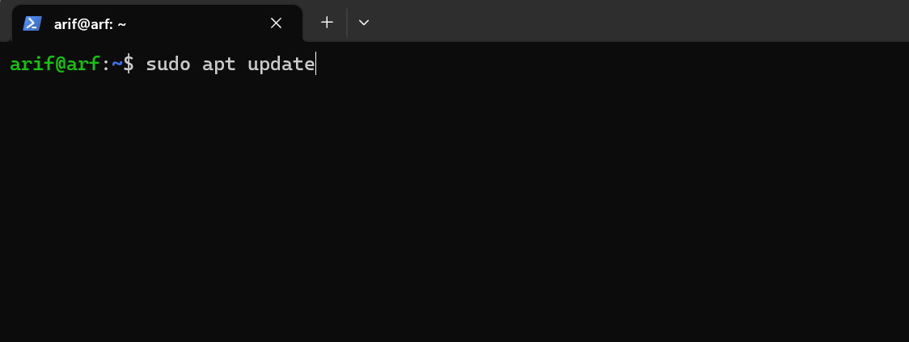
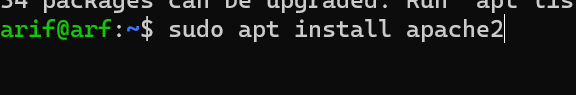
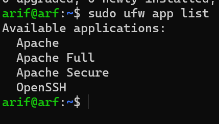
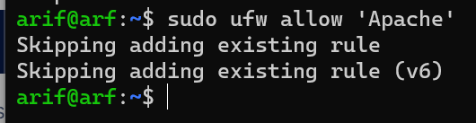
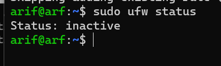
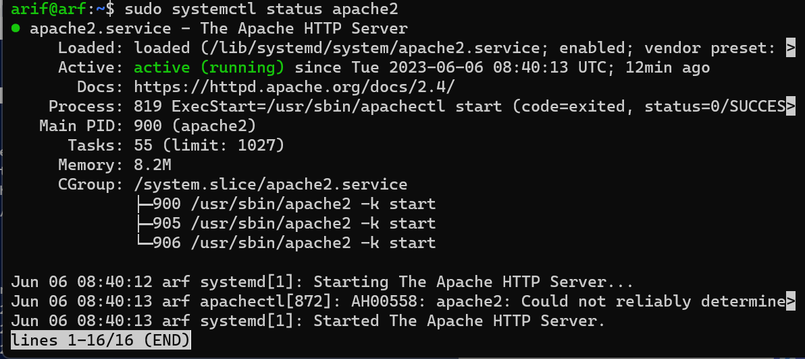
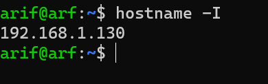
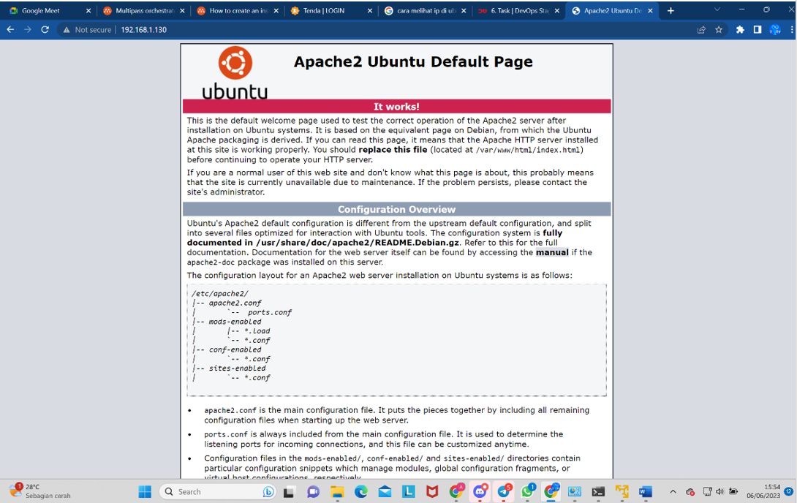

# 1.	Cari dan jelaskan 3 command shell selain yang ada di ebook!
Jawaban :

1. Whoami perintah whoami digunakan melihat nama dari user yang ada pada komputer kamu dan yang sedang kamu gunakan pada saat ini. Dengan mengetikkan perintah whoami pada terminal, kamu dapat melihat user yang sedang kamu gunakan pada komputer tersebut.

2. htop adalah program interaktif yang memantau resource sistem dan proses server secara real time. 
3. ps atau ‘process status’ menghasilkan snapshot dari semua proses yang berjalan di sistem Anda. Hasil statis diambil dari file virtual di sistem file /proc.

---

# 2.	 Perbedaan antara BASH dan Shell
Jawaban :

 Perbedaan Bash dan shell, Bash adalah superset dari sh yang berarti bash mendukung fungsi sh sambil juga menambahkan ekstensi tambahan. Sebagian besar perintah bekerja dengan cara yang sama seperti di sh, sedangkan shell adalah antarmuka pengguna-ke-sistem operasi yang memungkinkan pengguna untuk terlibat dengan komputer. 
1. Bash (Bourne Again Shell) Bash adalah program shell yang dikembangkan oleh Brian rubah sebagai pembaruan untuk aplikasi Bourne Shell 'sh. Di dalam bash menawrkan fitur-fitur seperti pengeditan baris perintah, pengikatan kunci, dan riwayat perintah tanpa akhir. Contoh :
- pushd built-in digunakan untuk menambahkan direktori ke stack.
- popd built-in digunakan untuk menghapus direktori dari stack.
- dirs built-in digunakan untuk menampilkan konten tumpukan direktori.
2. Shell adalah antarmuka baris perintah yang memungkinkan kita menjalankan perintah, program, dan skrip shell. Contoh:
-	Komentar, diawali dengan simbol #.
-	Shell mengeluarkan prompt,dengan symbol $ ini juga terkadang dikenal sebagai command prompt.

---

# 3.	Proses Instalasi Apache2 di ubuntu server 20.04.xxx

1.	Sebelum instal apache2 jangan lupa update terlebih dahulu server ubuntunya. dengan mengetik 'sudo apt update'

    

2.	Instal apache2 nya dengan mengetik 'sudo apt install apache2' dan tunggu sampe selesai.

    

3.	Setelah berhasil menginstal Apache2 lakukan pengecekan firewallnya. Perintah Ufw digunakan untuk melihat port dimana saja apache2 ini berjalan.dengan mengetik 'sudo ufw app list'
    
    

4.	Setelah mengetahui dimana saja apache berjalan. Disini saya menggunakan port 80 untuk apachenya. dengan mengeteik 'sudo ufw allow 'Apache' '
    
    

5.	Setelah melakukan perizinan port yang dapat diakses maka cek terlebih dahulu statusnya. dengan perintah 'sudo ufw status'
    
    

6.  cek juga apache nya sudah berjalana atau belum dengan mengetik 'sudo systemctl status apache2'
    
    

6.	Setelah dirasa aktif semua maka cek hostname untuk melihat di ip mana apache2 berjalan. Tulis perintah 'hostname -I'
    
    

7.	Copy Paste Ip server (hostname) yang ada terminal ke dalam seacrh engine dan Apache2 berhasil di instal.
    
    