# 1. Perbandingan antara Monolith & Microservices
- Arsitektur Microservices
Arsitektur microservices adalah model arsitektur aplikasi yang memisahkan aplikasi menjadi beberapa komponen yang independen yang dapat di-deploy dan diubah tanpa mempengaruhi komponen lainnya. 

- Arsitektur Monolitik
Arsitektur monolitik adalah cara pembuatan sistem yang menempatkan semua fungsi dan fitur dalam satu aplikasi tunggal yang besar. 

Perbandingan Arsitektur Monolitik dan Microservices
Arsitektur monolitik dan microservices adalah dua model arsitektur aplikasi yang berbeda yang memiliki kelebihan dan kekurangan masing-masing. Secara keseluruhan, arsitektur microservices lebih kompleks dibandingkan arsitektur monolitik, tetapi memberikan fleksibilitas dan skalabilitas yang lebih baik dalam pengembangan dan deployment aplikasi.

Arsitektur monolitik menempatkan semua komponen aplikasi dalam satu proyek atau satu kontainer. Ini membuat aplikasi lebih sederhana dan mudah diatur, serta memudahkan proses pengembangan dan deployment. Namun, karena semua komponen aplikasi terpisah dalam satu unit yang sederhana, ini dapat menyebabkan masalah skalabilitas dan fleksibilitas dalam jangka panjang.

Arsitektur microservices, di sisi lain, memisahkan aplikasi menjadi beberapa komponen yang independen yang dapat di-deploy dan diubah tanpa mempengaruhi komponen lainnya. Ini memungkinkan para pengembang untuk mengelola dan mem-deploy setiap microservice secara independen, serta mengelola skala dan performa setiap microservice dengan lebih baik. Namun, karena aplikasi dibagi menjadi beberapa microservices yang independen, ini dapat menjadi lebih kompleks dan rumit untuk dikembangkan dan di-deploy dibandingkan arsitektur monolitik.

---
# 2. Deploy Aplikasi wayshub-frontend (NodeJS)

1. Sebelum menginstal Nodes js jangan lupa ketik perintah 'sudo apt update'

    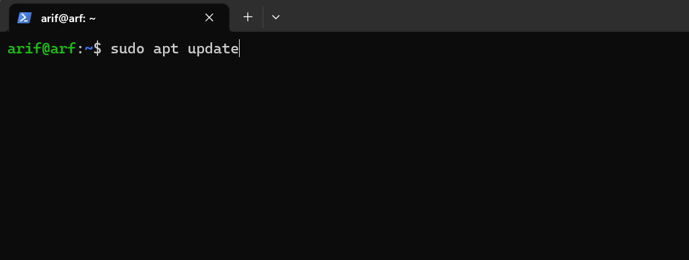

2. Selanjutnya install engine yang digunakan node js terlebih dahulu dengan mengetik 'curl -o- https://raw.githubusercontent.com/nvm-sh/nvm/v0.38.0/install.sh | bash'

    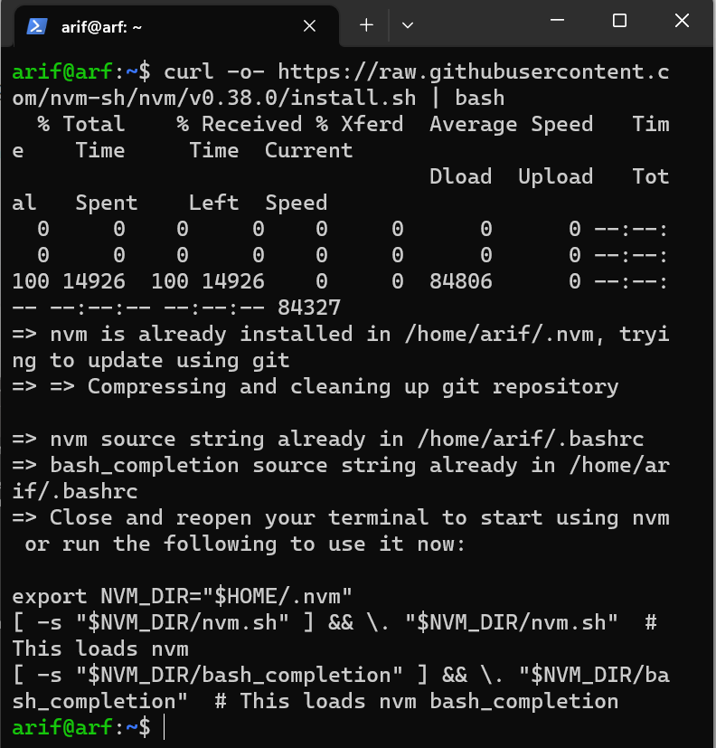

3. Setelah instal enginya kemudian ketik ’exec bash’ untuk memulai perintah baru

    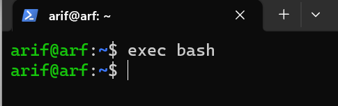

4. Selanjutnya instal NVM nya dengan ketik 'nvm install 16'

    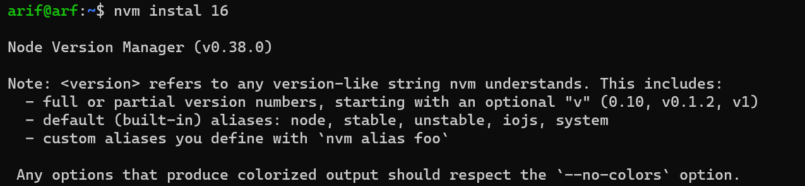

5. Setelah selesai instal cek nvm nya sudah benar belum dengan mengetik 'nvm use 16'

    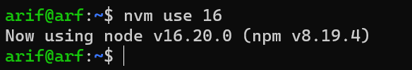

6. Cek juga nodejs nya dengan perintah 'node -v' dan 'npm -v'

    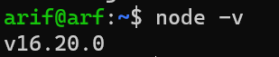
    [Alt text](img/Nodejs/7.png)

7. Selanjutnya bikin file baru dengan nama package.json, package.json ini berisikan isi informasi dari aplikasi yang akan kita buat. Perintahnya 'npm init -y'
    
    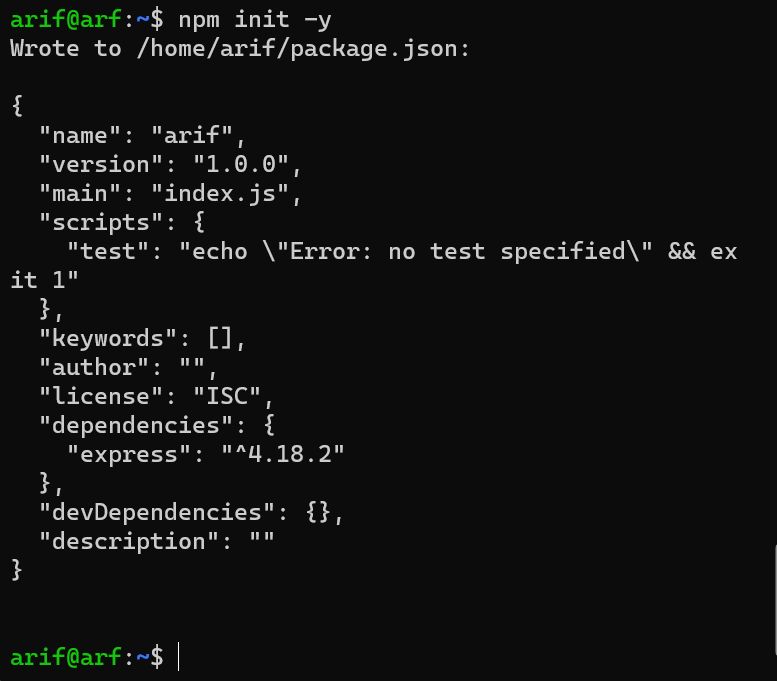

8. Selanjutnya kita akan menginstall Express JS. Express JS  dengan mengetik 'npm install express –save'

    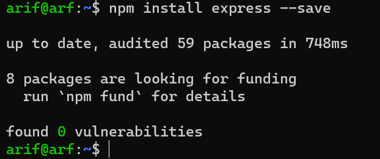

9. Selanjutnya bikin file yang berisi source code untuk menampilkan di tulisan Hello World! di web. Ketik perintah 'nano index.js'
    
    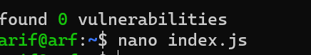

10. Tulis source code seperti gambar dibawah ini, setelah selesai tekan tombol CTRL + X lalu tombol y selanjutnya tombol enter.
    
    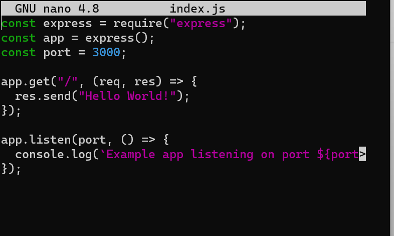

11. Setelah selesai ketik 'node index.js' perintah ini untuk mengetahui port mana yang digunakan 
    
    

12. Setelah mengetahui port mana yang digunakan coba masukan di search engine dengan ip_user@:3000
    
    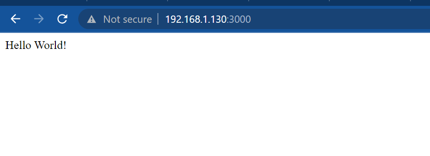

13. Selanjutnya kita copy paste link github 'https://github.com/dumbwaysdev/wayshub-frontend' copy link ke terminal.

    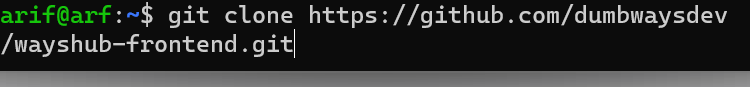

14. Selanjutnya coba lihat filenya sudah tersedia atau belum ke dalam server kita dengan menegetik ‘ls’
    
    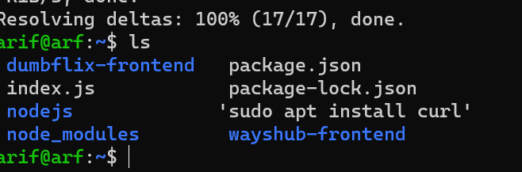

15. Masuk kedalam directory dengan mengetik 'cd wayshub-frontend/'

    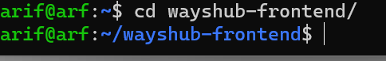

16. Setelah masuk lihat isi directory nya dengan perintah 'ls'
    
    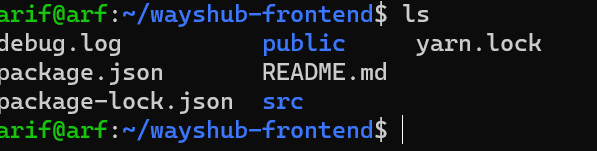

17. Setelah itu kita lihat terlebih dahulu isi file README.md nya dengan perintah 'cat README.md'

    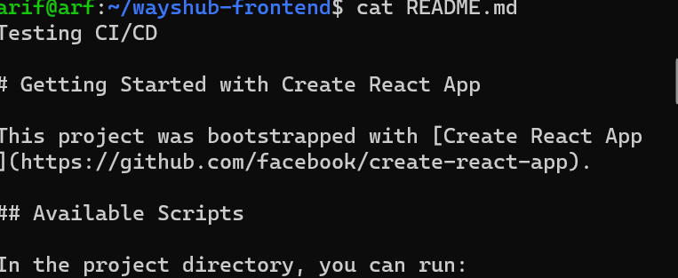

18. Kita juga lihat isi file di package.json sudah ada file atas nama wayshubnya dengan perintah 'cat package.json'
    
    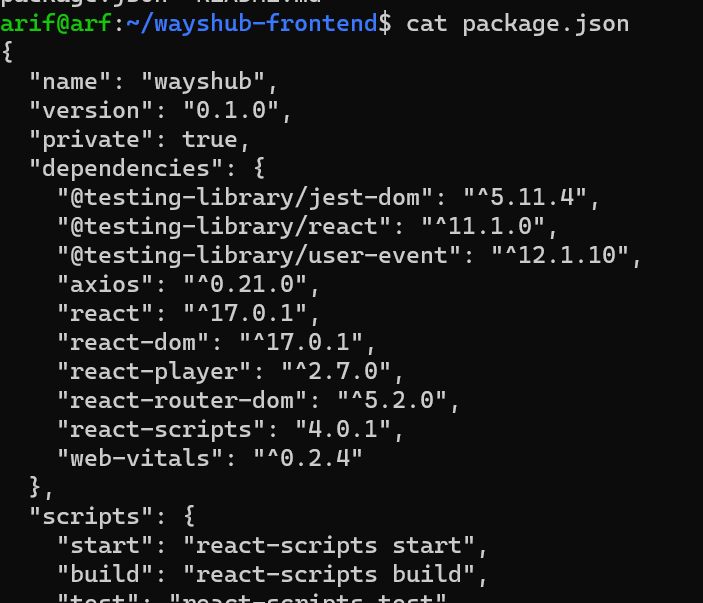

19. Setelah ada file package.json atas nama wayshubnya kita instal npmnya dengan perintah 'npm install'
    
    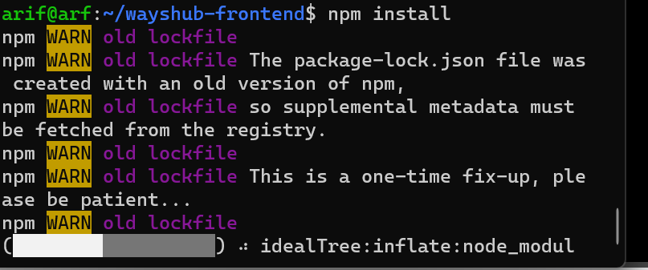

20. Setelah selesai instal npmnya kemudia nyalakan nmp nya dengan perintah 'npm start'
    
    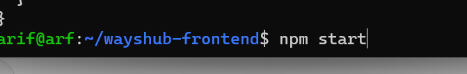

21. Setelah  selesai muncul gambar yang ada di bawah ini
    
    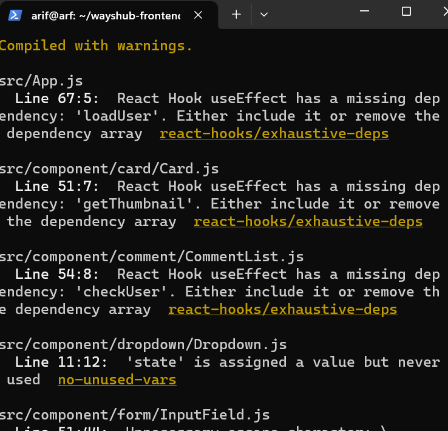

22.Kemudia kita masuk ke web lagi jalankan perintah ip_user:3000 kembali
    
    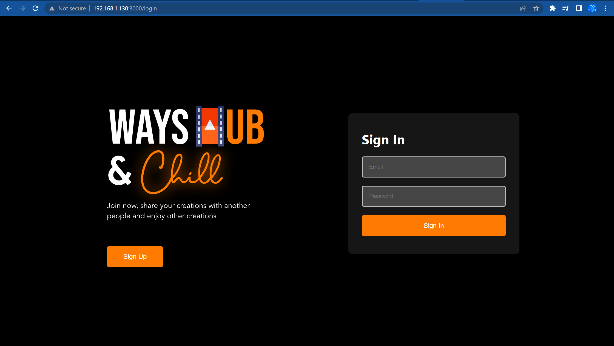

---
# Deploy Pyhton3

1.	pertama ketikan sudo apt update terlebih dahulu untuk update system yang ada di server ubuntu
    
    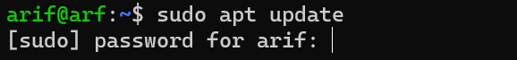

2. Buat folder tempat python3 nantinya dengan cara mengetik perintah 'mkdir namafolder'
3. masuk kembali kefolder yang kita buat dengan perintah 'cd namafolder'

4. selanjutnya ketik perintah 'python3 -v' untuk instal pythonnya

    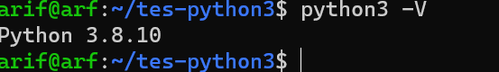

5.	Sekarang kita install package manager dari python3, dengan perintah 'sudo apt install python3-pip'. pip digunakan untuk menginstal flask
    
    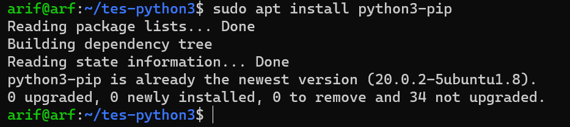

6.	Selanjutnya kita instal framework pythonnya dengan perintah ‘pip install flask’
    
    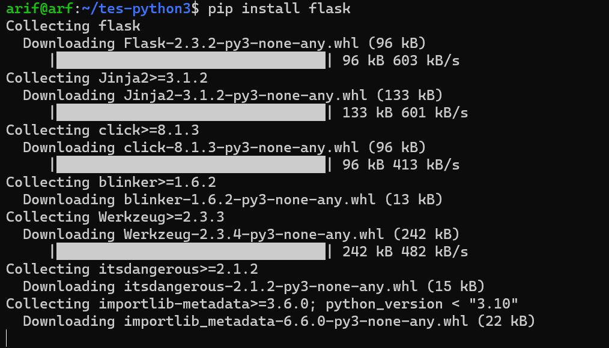

7.	selanjutnya bikin file yang berisikan source code dengan perintah ‘nano index.py’
    
    

8.	Masukan source codenya dan tambahkan bagian app.run(host='0.0.0.0.0') lalu tekan CTRL + K tekan Y dan tekan enter.
    
    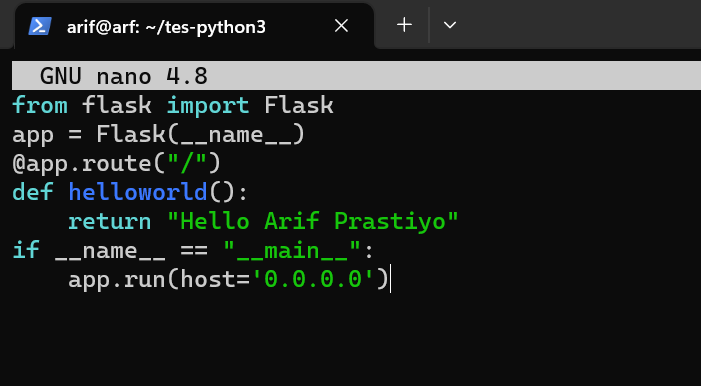

9.	Selanjutnya ketik ’python3 index.py’ untuk mengetahui dimana port yang digunakan 
    
    

10.	buka search engine dan masukan ip_user:5000
    
    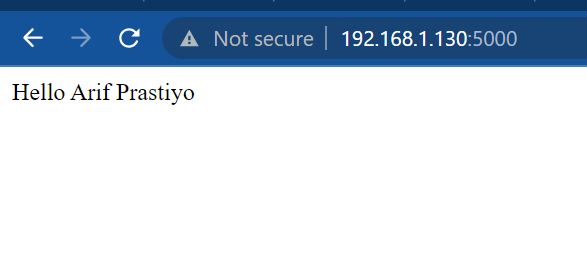

---
# Deploy Golang

1.	Jalanakn perintah ‘sudo apt update’ terlebih dahulu.
2.	buat folder directoryna dengan perintah ‘ mkdir namafolder’
    
    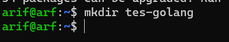

3.	Masuk ke folder directory yang kita bikin tadi dengan perintah ‘ cd namafolder’
    
    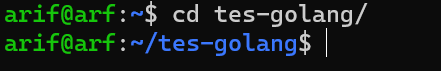

4.	Masukan perintah ‘wget https://golang.org/dl/go1.16.5.linux-amd64.tar.gz && sudo su’ untuk menginstal enginya.
    
    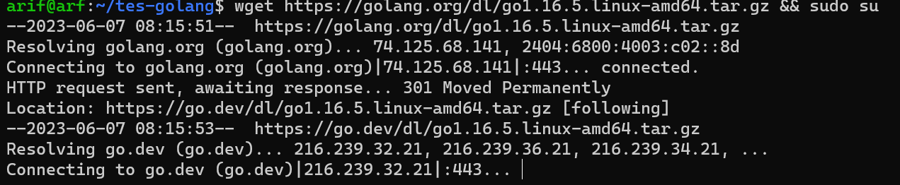

5.	Ketik perintah ‘rm -rf /usr/local/go && tar -C /usr/local -xzf go1.16.5.linux-amd64.tar.gz && exit’ dibagian root@arf
    
    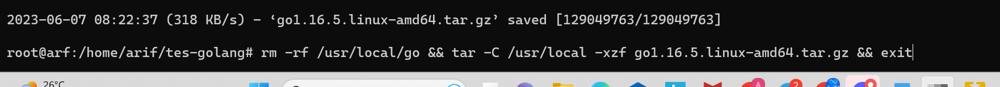

6.	Kemudian keluar terlebih dahulu dari folder dengan perintah ‘cd’
    
    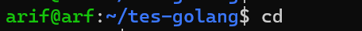

7.	Kemudian masukan path go nya ketik perintah ‘sudo nano .bashrc’
    
    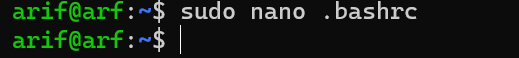

8.	Masukan source code ‘export PATH=$PATH:/usr/local/go/bin’ dibagian bawah sendiri lalu CTRL+X klik Y dan lalu enter
    
    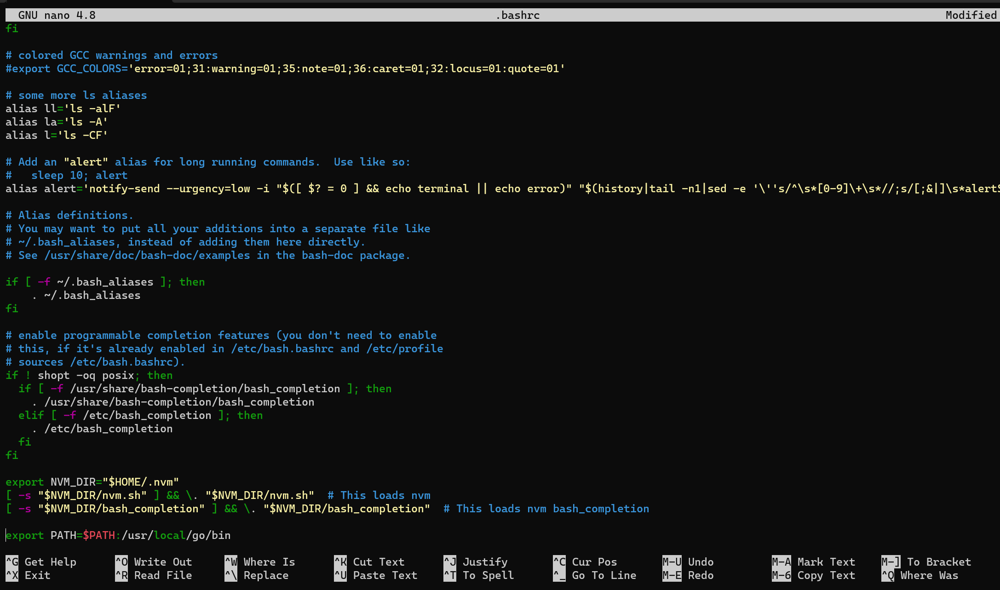

9.	Selanjutnya ketik perintah go version untuk melihat versinya

    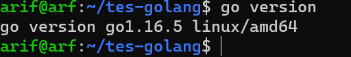

10. Masukan perintah 'nano index.go' diterminal, untuk membuat isi file

11.	Masukan source code dan tulisan yang akan di munculkan
    
    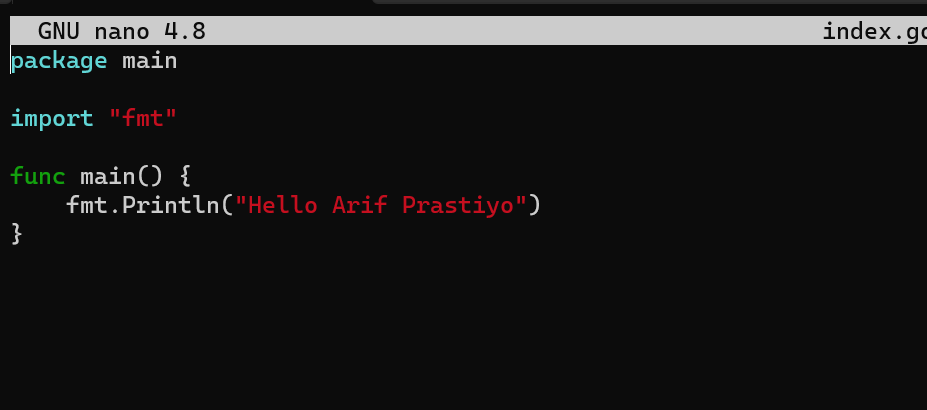

12.	Masukan perintah ‘go run index.go’ digunakan untuk menampilkan file yang sduafah di simpan index.go tadi.
    
    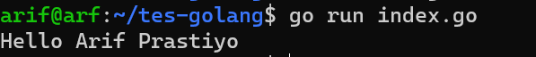

13.	Kemudian ketik ‘go build index.go’ untuk ngebuild filenya
    
    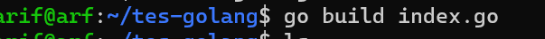
 
14.	Selanjutnya ketik ‘ls’ untuk melihat list directory yang tesimpan didalam folder
    
    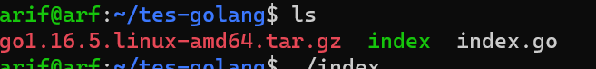

15.	Selanjutnya ketik ‘./index’ untuk menjalankan aplikasi.
    
    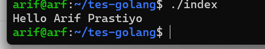