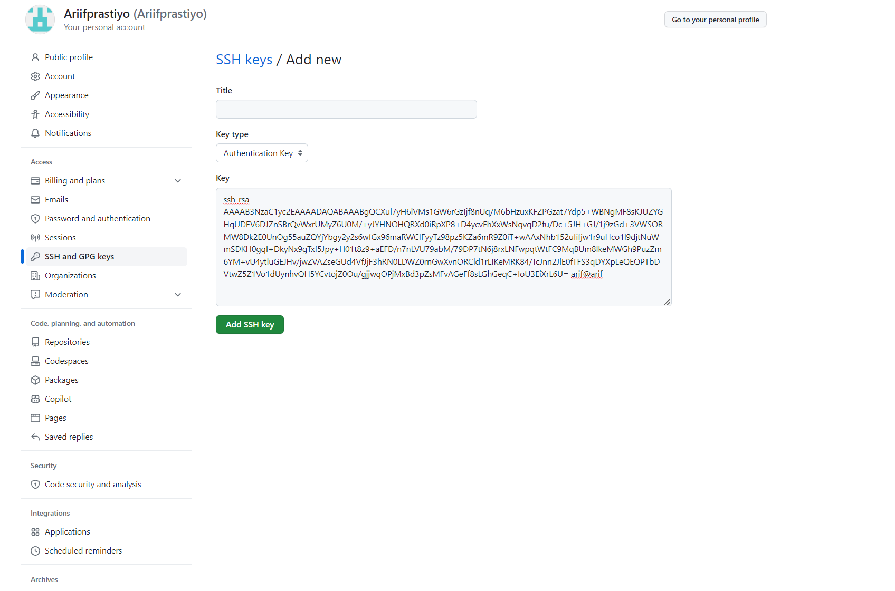
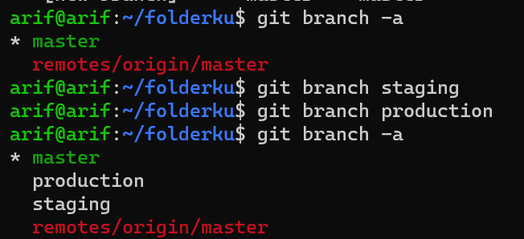

# 1. Penjelasan Distributed Version Control
   
    Jawaban: 

Sebuah tools yang digunakan untuk manajemen perubahan dari code.mempermudah developer untuk mentracking setiap perubahan berkelanjutan. pada dasarnya version control memiliki database yang terpusat dan bersifat online.

---
# 2. buat repository sample (diluar tugas) yang berisi 3 file dengan isi yang berbeda
# 3. Buat 2 branch
- Staging
- Production

Jawaban no 2 dan 3:

1. Buat Repository di github "Devops"

    
   
 - link ssh untuk github

    

2. Atur ssh-key nya sebelum kita masuk step selanjutnya, kita gunakagan ssh-keygen untuk membuat ssh keynya, dengan perintah 
  `ssh-keygen`

    

3. Selanjutnya kita langsung ke `cd .ssh` terus melihat isi foldernya dengan perintah `ls` selanjutnya masuk ke id_rsa.pub untuk melihat keynya dengan perintah `cat id_rsa.pub` kemudian copy isinya dan masuk ke pengaturan githubnya

    
- setelah masuk dipengaturan github ->SSH and GPG keys -> create -> Key (copy paste keynya yang dari CLI tadi) lalu save dengan cara klik tombol Add SSH key.

    

4. Buat manual sebuah file baru bernama `id_rsa` pada disk C:Users/Arif's/.ssh kemudian paste id_rsa yang kita ambil dari CLI kita. tidak perlu membuat authorization keys karena kita generate ssh-keygen di server local.

    

5. Step selanjutnya atur global dan email username (sesuaikan pada akun github yang sudah kita buat) dengan perintah `git config --global user.name "username github" ` dan  `git config --global user.email "email yang terdaftar di github" `

        

6. Langkah selanjutnya kita buat file dengan perintah pertama `git init` kemudian membuat 3 file berbeda dan kita lihat dengan get status.

    

    

7. commit terlebih dahulu sebelum ke tahap berikutnya. dengan cara perintah `git commit -m "first commit"`

    

8. langkah berikutnya memsaukan link ssh github kita untuk memulai perintah `git remote add origin git@github.com:username/repository.git` kemudian upload file ke akun github kita dengan perintah `git push origin master`

    

9. masuk kembali ke github via web kita refresh kembali maka file yang kita upload sudah tersedia di akun github kita.

    

10. Selanjutnya kita buat 2 branch production dan staging dengan perintah `git branch "nam_folder" `dan untuk mengecek dengan perintah `git branch -a`

     

11. masuk atau pindah directory ketik perintah '`it checkout "namarepository"`

    

12. Isi file yang kita buat tadi disini saya edit file_1 dan saya masukan ke branch staging  

    

13. commit terlebih dahulu `git commit -m "isi sendiri"` dan melihat perubahan tersebut dangan perintah `git push origin "namafolder"`

    

14. kita cek juga di githubnya untuk melihat updatetanya

    

---
# 4. Cari 3 command git yang belum dijelaskan

Jawaban: 
1. git pull
Untuk menggabungkan semua perubahan yang ada di remote repository ke direktori lokal, gunakan perintah pull:   
`git pull` 

2. git merge
Perintah merge digunakan untuk menggabungkan sebuah branch ke branch aktif. Gunakan:  
`git merge <nama-branch>`

3. git diff
Perintah git diff digunakan untuk menampilkan conflicts. Untuk melihat conflicts dengan file dasar, gunakan:  
`git diff --base <nama-file>`
