# 1. Penjelasan text manipulation beserta step by step
Jawaban :
## 1. mkdir, cd, cat.
- membuat folder dengan `mkdir namafolder`
- perintah `cd namafolder` digunakan untuk masuk kefolder
- `cat` digunakan untuk melihat isi file
- `cat > file` digunakan untuk menambah isi file tanpa text editor 
- untuk mengabungkan isi dari beberapa file bisa dengan perintah `cat file1 file2 file3 > file4`

  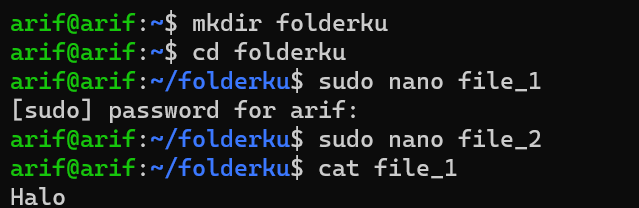  

    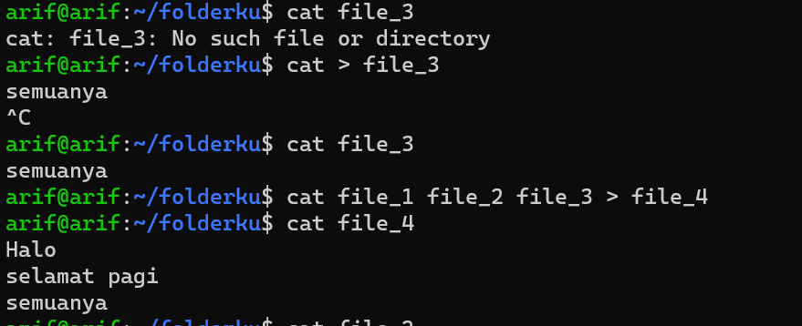

## 2. sed, grep

- untuk merubah isi file dengan kata tertentu dengan perintah `sed -i 's/pagi/sore/g' file_yangdituju`
- grep digunakan untuk mencari kata tertentu di file dengan perintah `grep (kata yg mau dicari) fileygdituju`
- untuk menghitung jumlah kalimat yang berada di file `grep -c filedituju`
- `grep (kata yg mau dicari) *` digunakan untuk mencari file yang berisi suatu kata

    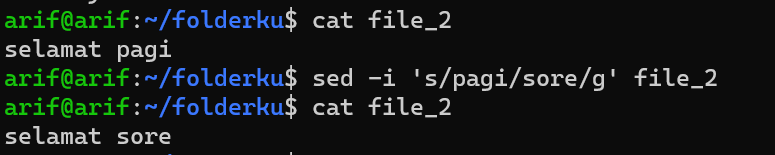

    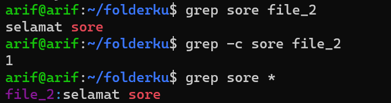

## 3. Short
- untuk mengurutkan berdasarkan abjad ataupun angka `sort fileygdituju` & `sort -r fileygdtuju`
    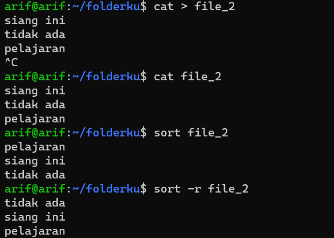

## 4. AWK, Cut

-  `awk '{print $1}' file` digunakan untuk mengurutkan kata pertama kedua atau seterusnya 
- `cut -b file` untuk mengambil huruf pertama, kedua, dan seterusnya
- `cut -c 1,2,3 file` untuk mengambil beberapa huruf tertentu didalam kata
- `cut -d " " -f 1 file` untuk mengambil file tertentu

    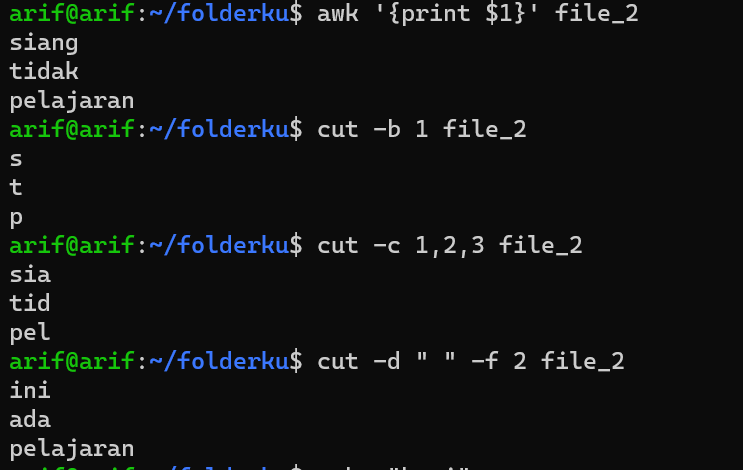

## 5. Echo
- `echo "kata"` digunakan untuk mencetak angka
- `echo "kata" > file` digunakan untuk mereplace/menumpuk kata ke file yang dituju 
- `echo "kata" >> file` digunakan untuk menambahkan kata baru di file

    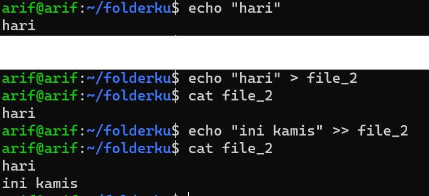

---

# 2. Penjelasan tool htop atau nmon

Jawaban :

1. Tampilan nmon setelah di install

    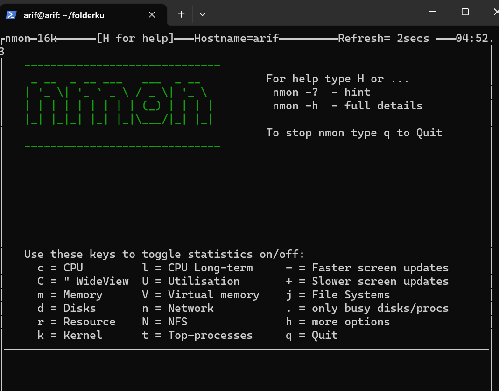

2. Ada beberpa tombol yang digunakan di nmon antara lain :

- Misalnya, menekan C akan mengalihkan tampilan penggunaan CPU:

    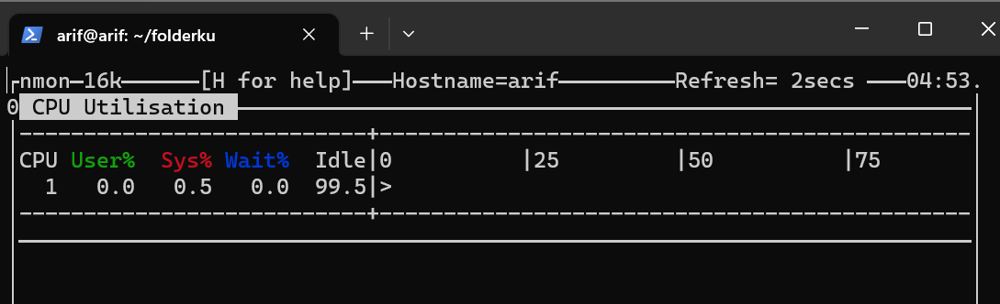

- Menekan N akan mengalihkan ke tampilan jaringan dan secara otomatis menumpuknya di bawah tampilan CPU:

    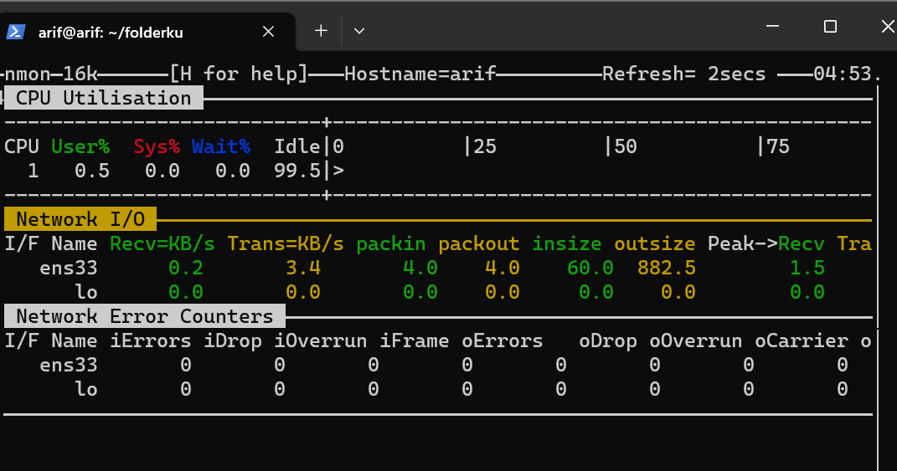

- Terus tekan tombol lain untuk menyusun metrik tambahan dalam tampilan yang sama. Misalnya, gunakan D  untuk Disk I/O, M untuk Memori, dan T untuk proses Atas.

    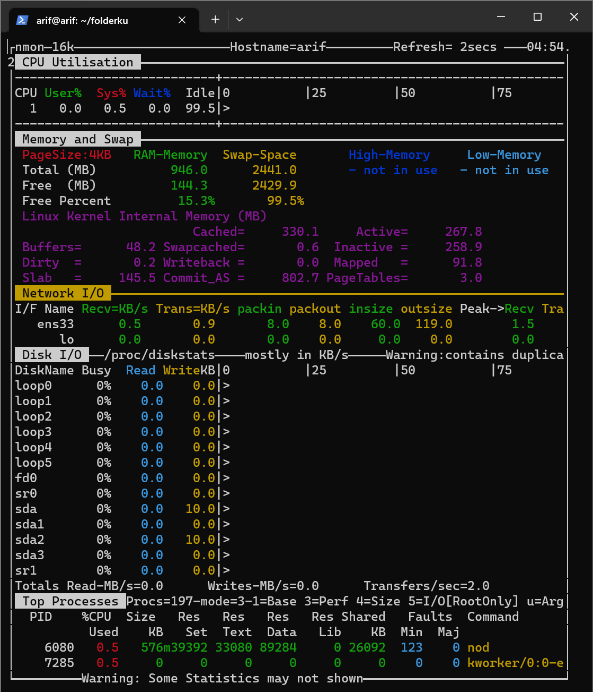

- Selain menumpuk monitor baru, kita juga dapat menekan tombol titik atau titik (.) untuk hanya menampilkan CPU dan disk yang sibuk, serta + dan - untuk menambah atau mengurangi waktu penyegaran layar. Gunakan H untuk menampilkan bantuan.tekan Q untuk keluar dan mengakhiri sesi pemantauan.

    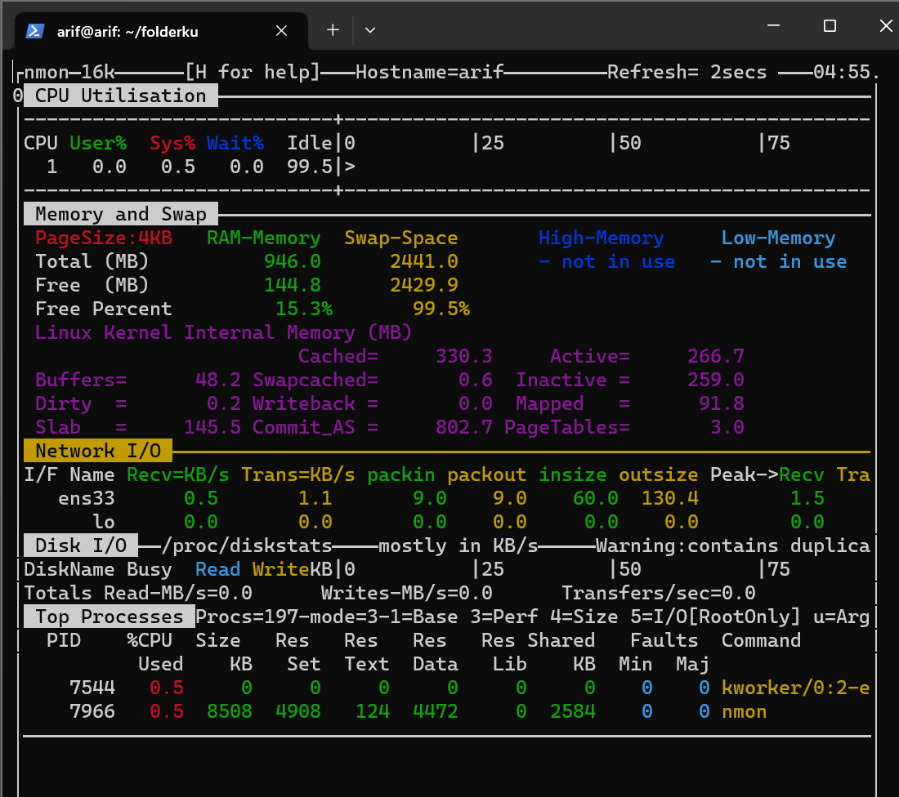
    
    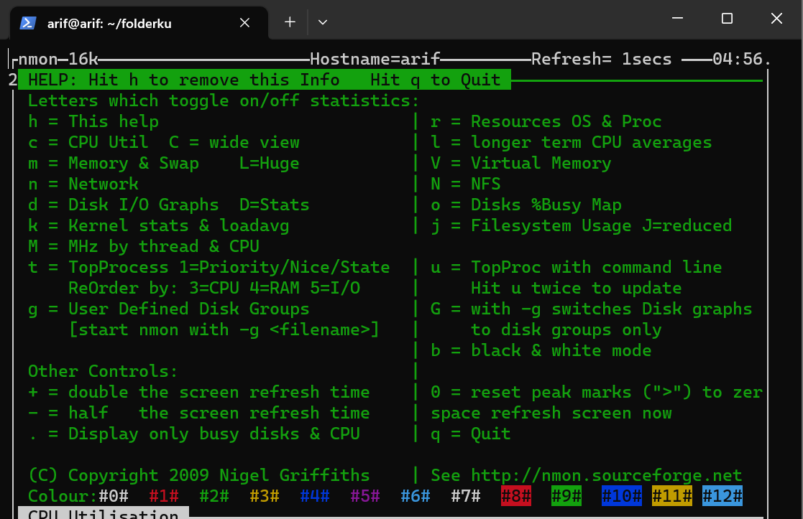