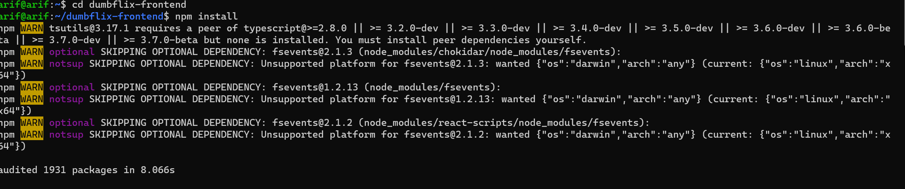
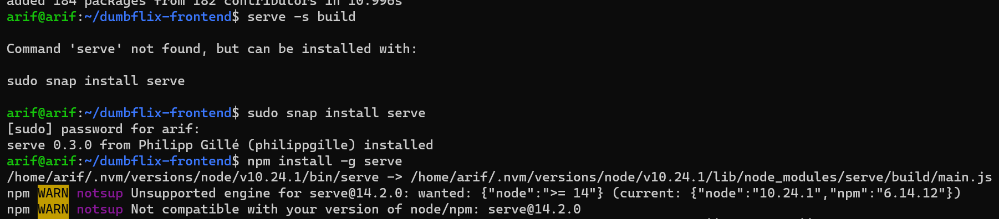

# 1. Buat 2 VM untuk penggunaan :
# - aplikasi Dumbflix
# - nginx & Dumbflix secara bersamaan
# 2. Gunakan konfigurasi Load Balancing, lalu tes apakah bekerja dengan baik atau tidak
---
Jawaban :

1. Disini saya memakai 2 Vm yang satu dengan ip `192.168.1.124`

    

2. Tambahkan ip yang digunakan dengan masuk ke `/etc/hosts`

     

3. Masuk file hosts di dalam pc kita dan tambahkan ipserver dan somain kita

    

4. Cek juga nginx nya dengan `nginx -v` karena server 2 ini saya tidak pakai nginx maka akan muncul seperti dibawah ini. nginx hanya diinstall di server 1.

    

5. Masuk kedalam folder dumbflix-frontend dan install npm

     

6. Masukan run build untuk membundle Aplikasinya dengan perintah `npm run build`

    

7. Install pm2 nya

        

8. Install `sudo snap install serve` dan juga install juga `npm install -g serve`

    

9. Jalankan pm2 nyadengan perintah `pm2 serve build`

    
    
    

10. Jalankan ip_server dan port 8080 di chrome

    

11. Dengan pengaturan nginx di server 1 kita tadi maka tidak masalah server 1 kita mati aplikasi masih tetap bisa berjalan di dengan domain yang sama.

    

    

    