# 1. Instalasi nginx melalui apt
# 2. menjalankan aplikasi dumbflix menggunakan PM2
# 3. buatlah konfigurasi reverse proxy!
# (Gunakan 2 server untuk memenuhi challenge, tidak wajib)
--- 
Jawaban :

1. Pertama install nginx terlebih dahulu `sudo apt install nginx`

    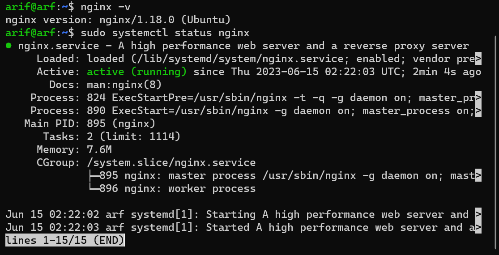

2. Lihat nginx dengan perintah `nginx -v`

    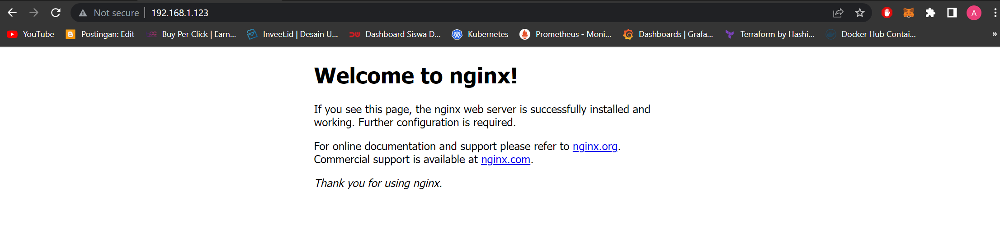

3. Selanjutnya masuk ke folder `cd dumbflix-frontend` install npm `npm install` 

    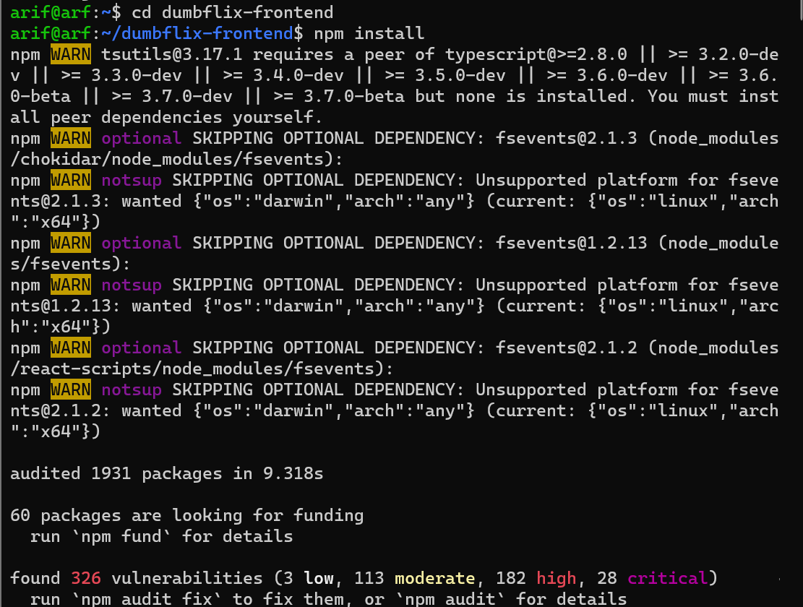

4. Jalanakn npmnya dengan perintah `npm run build`

    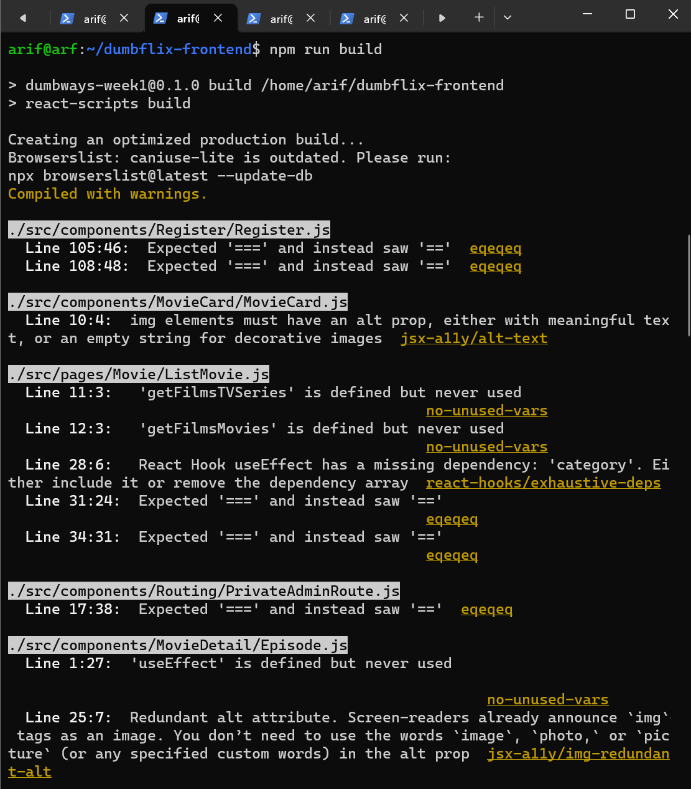

5. Sebelum ke step berikutnya install pm2 dengan perintah `npm install -g pm2`

    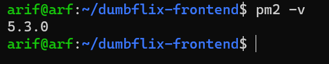

6. ketik perintah `serve -s build` untuk mengathui command untuk menjalankan serve. ketik perintah `npm  snap install serve`  dan `npm install -g serve`

    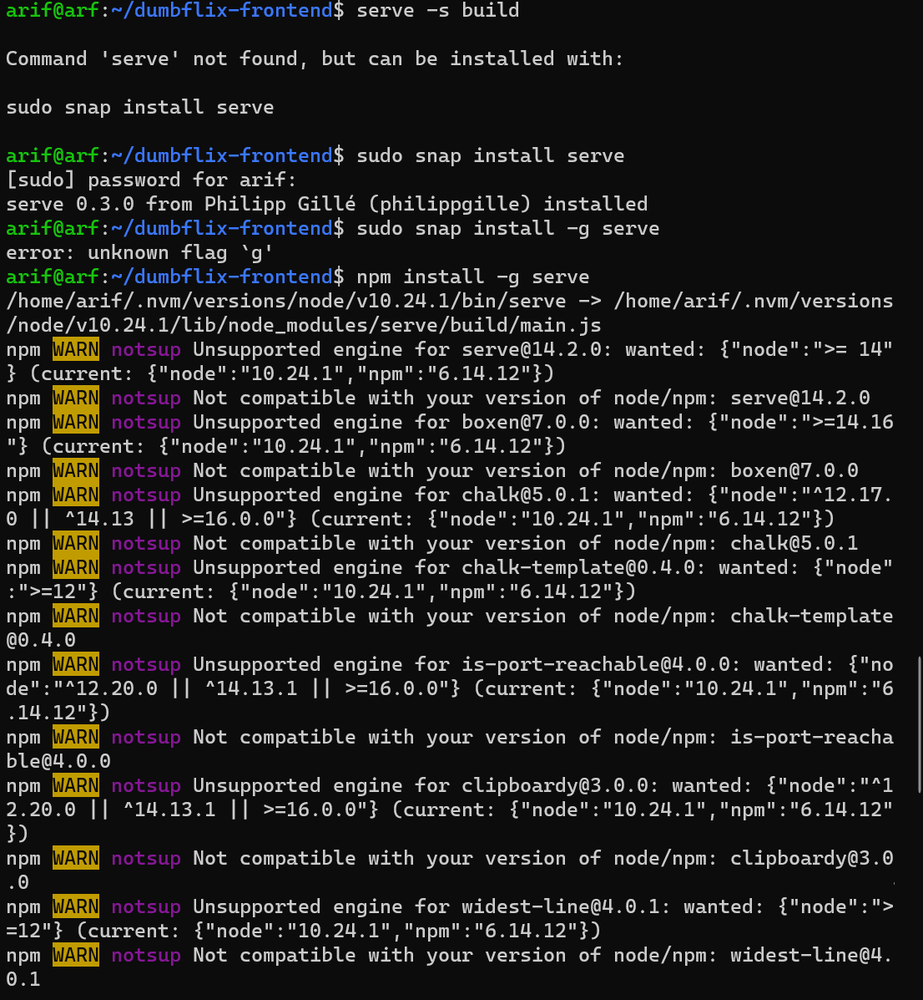

7. ketik perintah `pm2 serve build` untuk menjalankan pm2 nya. disini aplikasi berjalan di port 8080.

    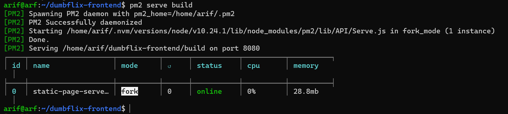

8. masuk ke crhome dan masukan ipserver dan port 8080.

    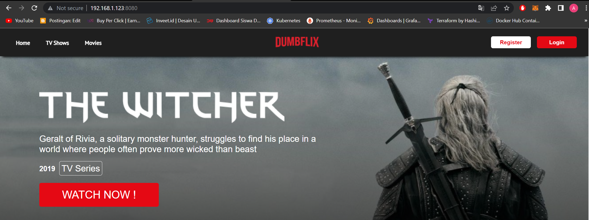

9. keluar dari folder dumbflix-frontend dan masuk ke folder nginx `cd /etc/nginx` buat folder dengan nama dumbways `mkdir dumbways` dan masuk ke foldernya dengan perintah `cd dumbways` dan buat file bernama my.reverse-proxy.conf `sudo nano my.reverse-proxy.conf`.

    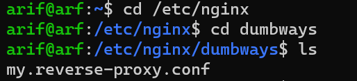

10. masukan di bagian proxy "ipserver:8080" dan server name "dumbflix-namapanggilan.xyz".

    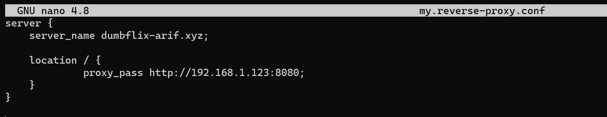

11. masukan ipserver:8080 dan nama domain kedalam hosts pc kita

    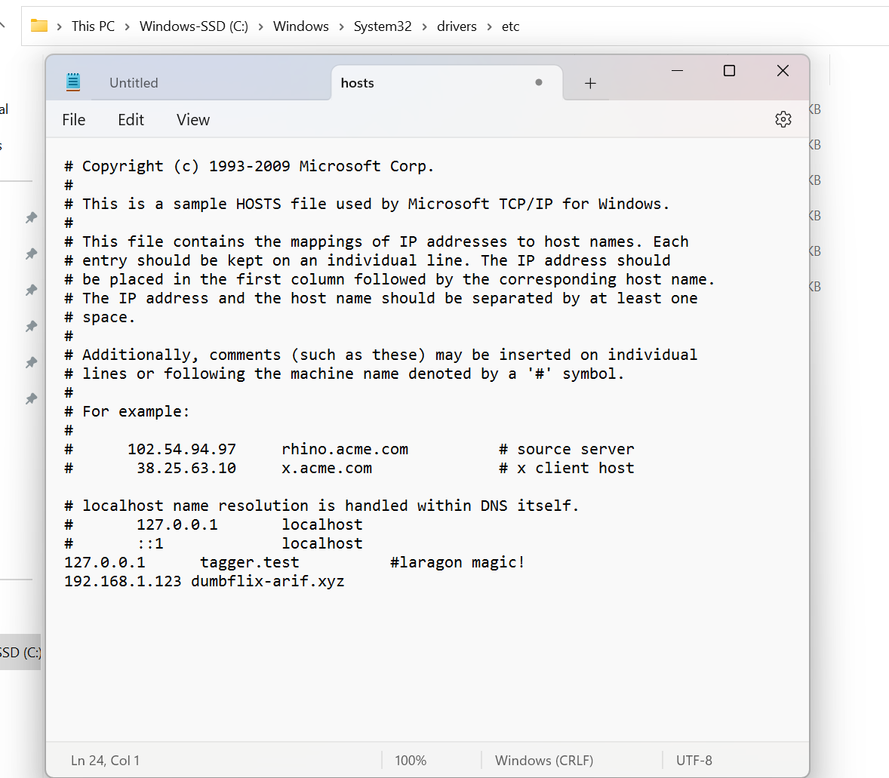

12. Keluar dulu dari folder dumbways `cd ..` dan bikin file baru `sudo nano nginx.conf`  masukan folder yang bernama dumbways dengan perintah `include /etc/nginx/dumbways/*;`

    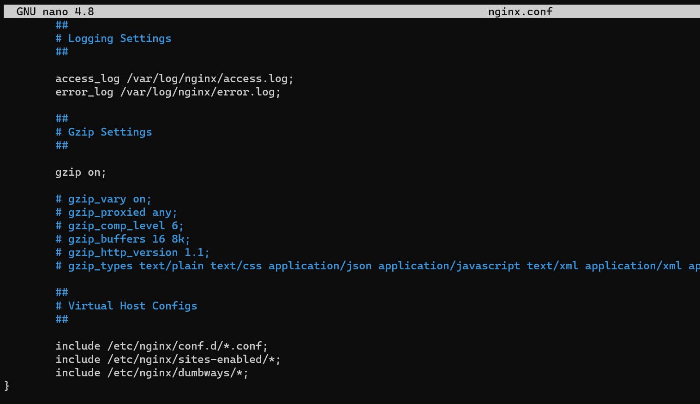 

13. lihat file yang kita tambahkan dengan perintah `sudo nginx -t`

    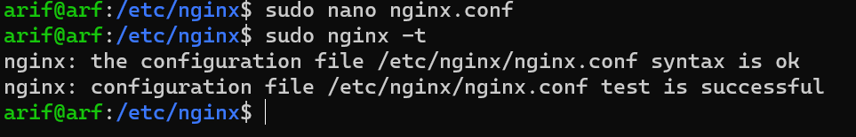

14. Reload dan cek status nginx

    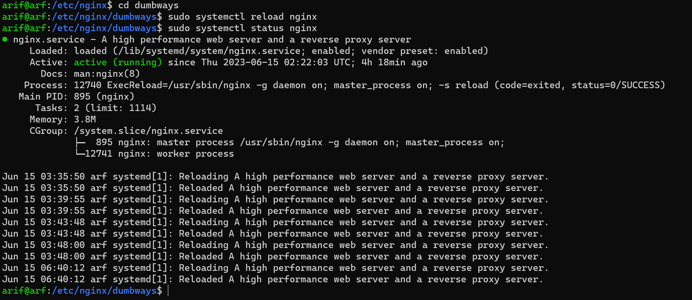

15. jalankan domain kita `dumbflix-arif.xyz` ke crhome dan kita sudah berhasil seting aplikasinya.

    

16. untuk menjalankan load balancing kita akan mengatur my.reverse-proxy seperti pada gambar. kita akan melanjutkannya pada pembahasan load balancing dengan 2 vm.

    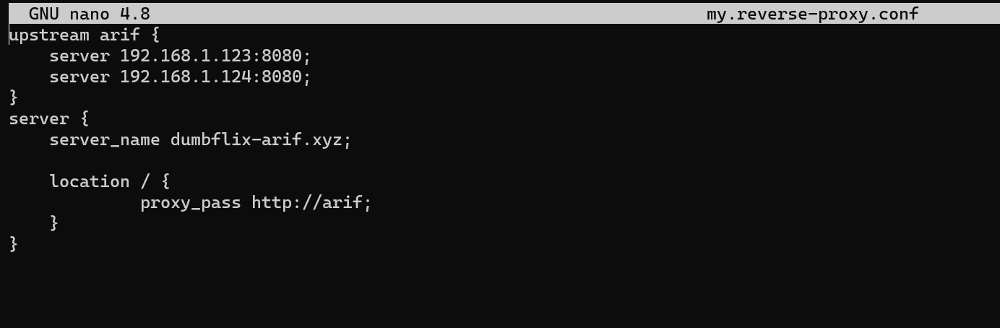